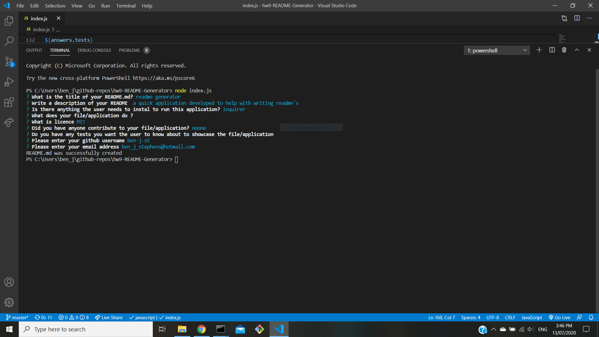

# a good README generator  

    

## Description 

this is the readme for a readme generator, using node.js and some npm packages, i created a readme generateror, to help with the construction of readmes and take some of the stress out of providing complete documents to new projects

## Table of Contents

* [Description](#Description)
* [Installation](#Installation)
* [Usage](#Usage)
* [Licence](#Licence)
* [Contributing](#Contributing)
* [Tests](#Tests)
* [Questions](#Questions)

## Installation

step 1 - user will need to clone down the repo into a desired folder using: git clone 
    on this address https://github.com/ben-j-st/hw9-README-Generator.git

step 2 - user will need to use the code: npm i  
    to install all dependencies listed in the package.json file

step 3 - user can then run the file from terminal on there index.js file by using the code:
    node index.js 
    
step 4 - answer the question to have a readme file generated based on the responses to the question 

step 5 - happiness and not writing readme's from scratch

## Usage

generate a readme based on the input from the user to each of the desired questions

## Licence 

MIT

A short and simple permissive license with conditions only requiring preservation of copyright and license notices. Licensed works, modifications, and larger works may be distributed under different terms and without source code. see full licence at https://choosealicense.com/licenses/mit/

## Contributing 

was built based on specifications from trilogy 

## Tests

none at this time

## Questions

Github Username: <a href="https://github.com/ben-j-st">ben-j-st</a>

Email: ben_j_stephens@hotmail.com

## Screenshot 

click on the image to be taken to the walkthrough video 

 

## Walk through Video

(https://drive.google.com/file/d/1EW-khpbN5OIwe5NYnfh3E86urBOlzfiU/view)
